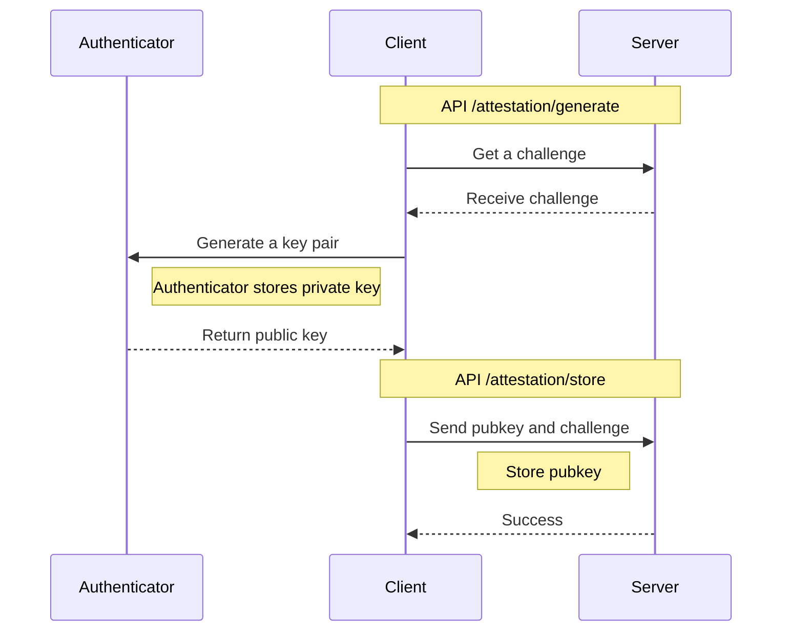
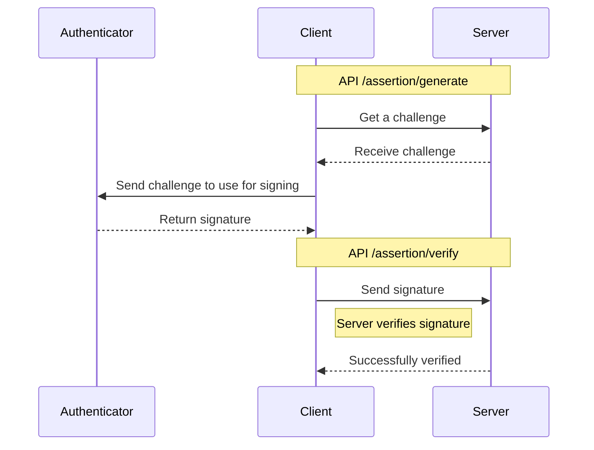

# Passkeys Demo

:warning: **This passkeys demo is not secure.** :warning:

It still needs input validation on everything, however it is at least a somewhat reasonable way of architecting and storing passkeys.

## Architecture

-   Cloudflare workers for server endpoints
-   Cloudflare KV for temporary cache
-   Cloudflare D1 for storing public keys and user information
-   Github pages for the client code

## Passkeys Flows

### Attestation

### Assertion

