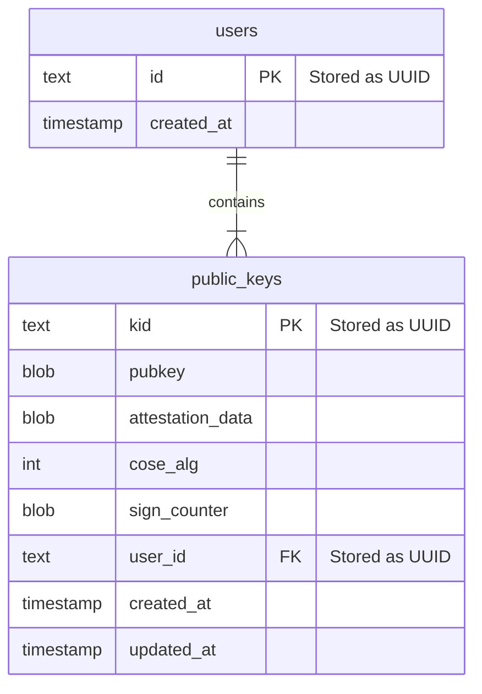
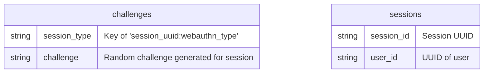
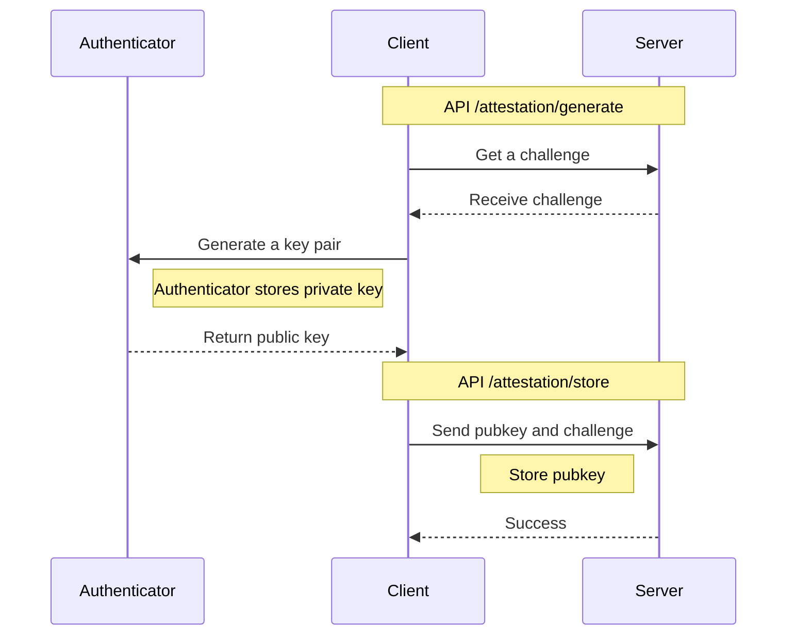
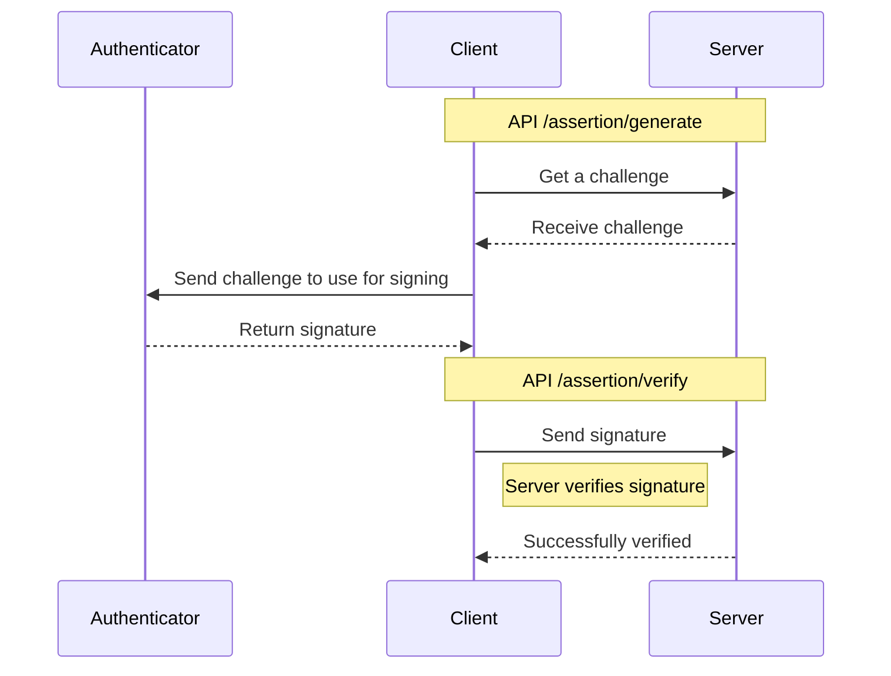

# Passkeys Demo

:warning: **This passkeys demo is not secure.** :warning:

It still needs input validation on everything, however it is at least a somewhat reasonable way of architecting and storing passkeys.

## Architecture

-   Cloudflare workers for server endpoints
-   Cloudflare KV for temporary cache
-   Cloudflare D1 for storing public keys and user information
-   Github pages for the client code

### Database

See [database schema](https://github.com/nealfennimore/passkeys/blob/main/src/server/db/schema/schema.sql).

### Cache

All challenges expire in 5 minutes. All sessions expire in 24 hours.

## Passkeys Flows

Any user can have any username they want in this passkeys demo. The client browser generates the user id that will belong to that username, and that user id (which is an uuid v4) is the only piece of information that's stored about the user, along with their public key, and optional attestation data.

Since there's no identifiable user information, this can be considered an anonymous passkey implementation. As such, you'd be missing a way of keeping in touch with your users were you to implement the same demo.

### Attestation

### Assertion

